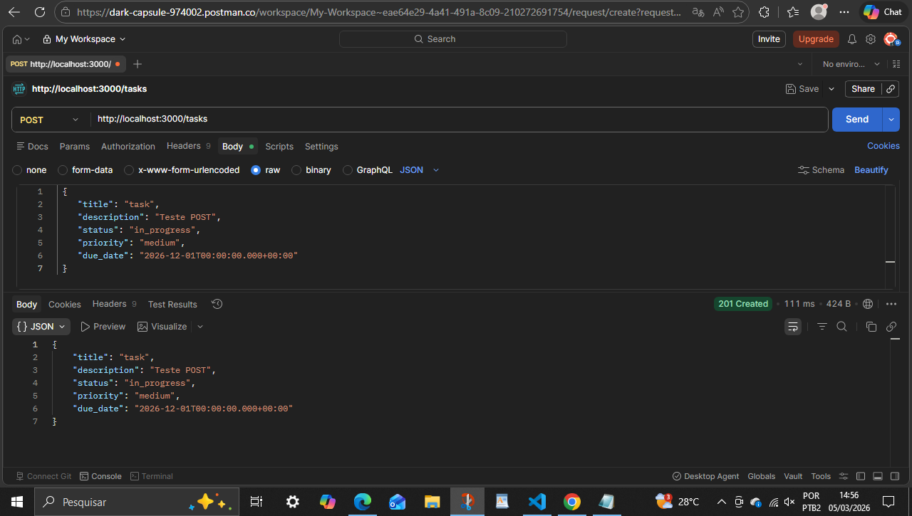
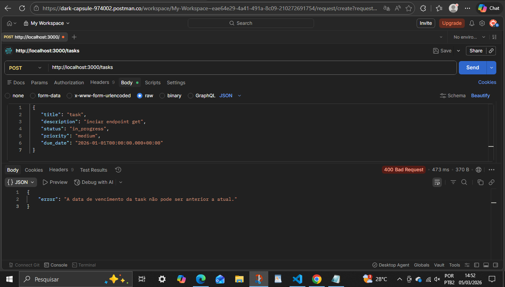
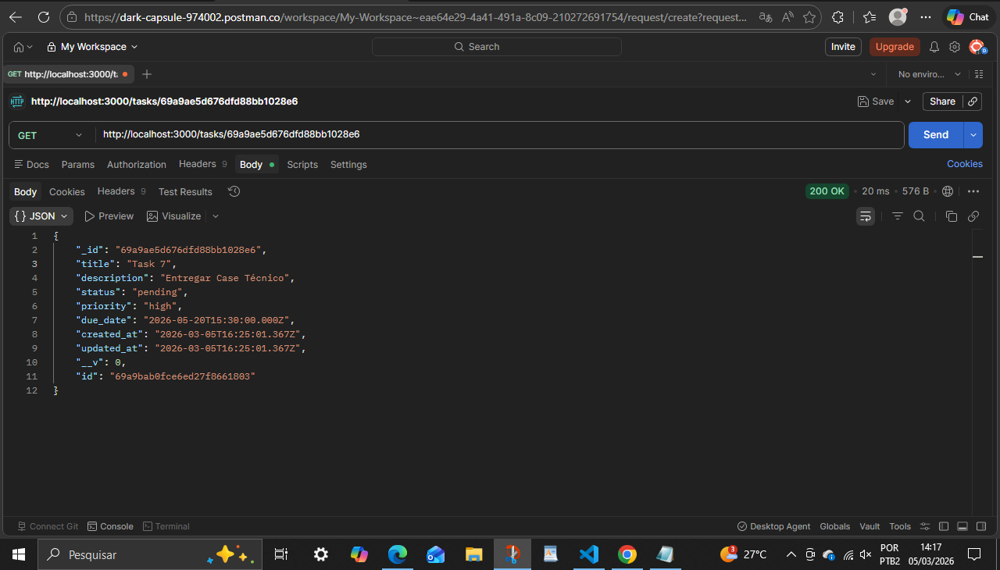
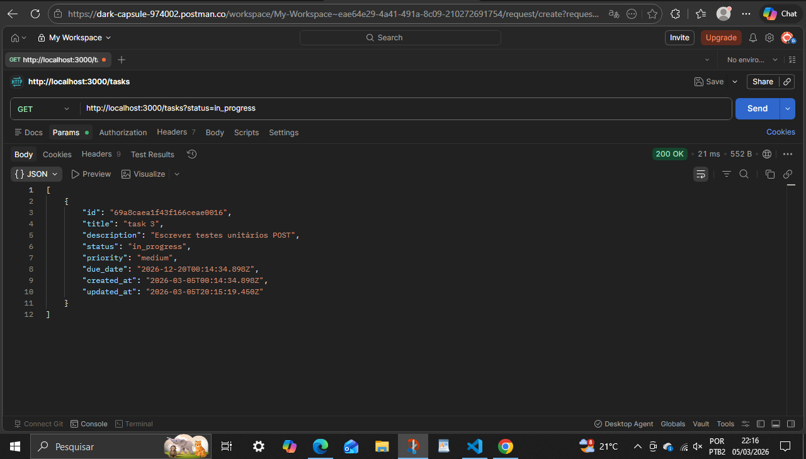
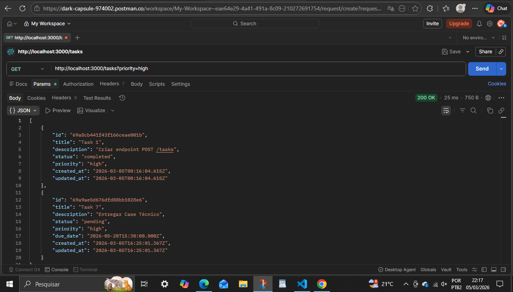
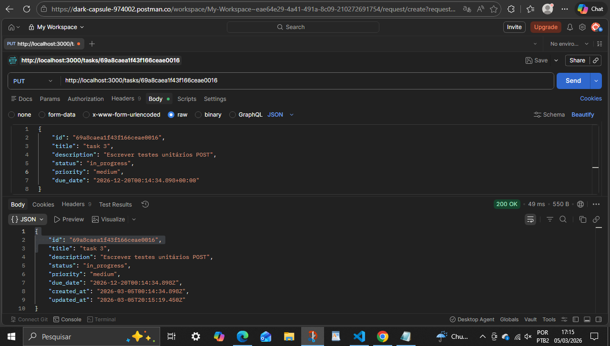
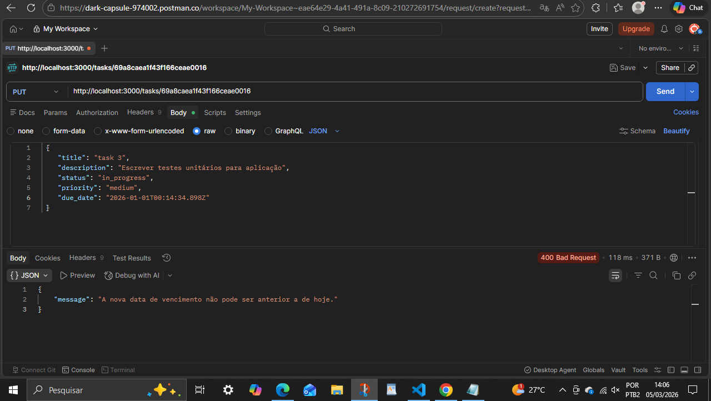
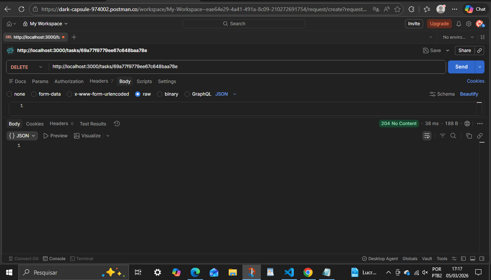

 # Desafio Técnico - API de Gerenciamento de Tarefas (To-Do List)

Esta é uma API RESTful para gerenciamento de tarefas, desenvolvida como parte do processo seletivo para a posição de Analista de Engenharia de TI Júnior. A aplicação foi construída focando em escalabilidade, testabilidade e separação de preocupações.

##  Tecnologias Utilizadas

- Runtime: Node.js v18+
- Linguagem: TypeScript
- Framework Web: Express
- Banco de Dados: MongoDB Atlas (via Mongoose)
- Validação: Zod
- Logs: Pino (Estruturados em JSON)
- Testes: Jest
- Containerização: Docker & Docker Compose
- CI/CD: GitHub Actions

## Arquitetura e Design Patterns
A aplicação segue os princípios da Clean Architecture (Arquitetura Limpa), dividida nas seguintes camadas:
- Domain: Contém as Entidades de negócio e as interfaces (contratos) dos Repositórios. É a camada mais interna e não possui dependências externas.
- Application: Contém os Casos de Uso (Use Cases). Aqui reside a lógica de orquestração da aplicação.
Infrastructure: Implementações de detalhes externos como a conexão com o banco de dados (MongoDB), Repositórios concretos, e drivers de log.
- Main: A "Composition Root". Onde as dependências são instanciadas via Factory Pattern e as rotas são configuradas.

### Principais Padrões Aplicados:
- Dependency Injection: Use Cases recebem interfaces de repositórios, facilitando a inversão de dependência.
- Repository Pattern: Desacopla a lógica de negócio da tecnologia de persistência.
- Factory Pattern: Centraliza a criação de objetos complexos e suas dependências.
- Data Mapper: O repositório converte o _id nativo do MongoDB para o id da entidade de domínio, mantendo o domínio puro.

## Regras de Negócio Implementadas
A API cumpre com os requisitos solicitados:
- Validação de Status: Apenas pending, in_progress, completed e cancelled.
- Validação de Prioridade: low, medium, high.
- Título: Obrigatório, com validação de 3 a 100 caracteres.
- Data de Vencimento: Bloqueio de criação ou edição de tarefas com datas no passado.
- Imutabilidade de Tarefas Concluídas: Uma tarefa com status completed não pode ser editada (regra validada no UpdateTaskUseCase), apenas deletada.

## Como Executar
- Pelo Docker:
Certifique-se de ter o Docker e Docker Compose instalados:

```console
docker-compose up --build
```

A API estará disponível em http://localhost:3000.

- Localmente:
Instale as dependências: npm install. Configure o .env:
Execute em modo de desenvolvimento: 

```console
npm run dev
```


## Endpoints da API
```markdown
Método	    Endpoint	    Descrição
- POST	    /tasks      	Cria uma nova tarefa.
- GET	    /tasks      	Lista todas as tarefas **(Suporta filtros ?status= e ?priority=)**.
- GET	    /tasks/:id	    Busca uma tarefa específica pelo ID.
- PUT	    /tasks/:id	    Atualiza dados de uma tarefa (respeitando a regra de imutabilidade).
- DELETE	/tasks/:id	    Remove uma tarefa.
```


## Testando rotas 
1. Mensagem inicial (GET http://localhost:3000/ )
EXEMPLO DE RESPOSTA (Postman):


2. Adicionar TASK (POST http://localhost:3000/tasks )
EXEMPLO DO BODY ENVIADO (Thunder Client):
```console
{
    "title": "Task 6",
    "description": "Testar API no Postman Endpoint POST",
    "status": "in_progress",
    "priority": "medium",
    "due_date": "2026-05-20T15:30:00Z"
}
```
EXEMPLO DE RESPOSTA (POSTMAN):


Regras de negócio: Não permitir data de vencimento anterior ao dia de hoje


3. Pesquisar por todas as tasks ( GET http://localhost:3000/tasks )


4. Pesquisar por UMA task ( GET http://localhost:3000/tasks/:id )
EXEMPLO DE USO (Thunder Client): 
```console
GET http://localhost:3000/tasks/id
```
EXEMPLO DE RESPOSTA (POSTMAN):



5. Pesquisar task POR FILTROS (status) ( GET http://localhost:3000/tasks?status=value )
EXEMPLO DE USO (POSTMAN): 
```console
GET http://localhost:3000/tasks?status=value 
```
EXEMPLO DE RESPOSTA (POSTMAN):



6. Pesquisar task POR FILTROS (priority) ( GET http://localhost:3000/tasks?priority=value )
EXEMPLO DE USO (POSTMAN): 
```console
GET http://localhost:3000/tasks?priority=value
```
EXEMPLO DE RESPOSTA (POSTMAN):




7. Editar informações de uma task ( PUT http://localhost:3000/tasks/id)
EXEMPLO DO BODY ENVIADO (POSTMAN):
```console
{

    "title": "Task",
    "description": "Testar API no Postman  - Endpoint PUT",
    "status": "in_progress",
    "priority": "medium",
    "due_date": "2026-05-20T15:30:00Z"

}
```
EXEMPLO DE RESPOSTA (POSTMAN):



Regras de negócio: Não permitir data de vencimento anterior ao dia de hoje



8. Excluir um produto dos registros ( DELETE http://localhost:3000/tasks/:productCode)
EXEMPLO DE USO (POSTMAN): 
```console
GET http://localhost:3000/tasks/id
```

EXEMPLO DE RESPOSTA (POSTMAN):




## Testes unitário com Jest
Foram implementados testes unitários focados nos Casos de Uso, garantindo que as regras de negócio funcionem independentemente do banco de dados.
Para rodar os testes:

```console
npm run test
```


## Observabilidade (Logs)
A aplicação utiliza o Pino para gerar logs estruturados, prontos para serem consumidos por ferramentas de agregação de logs (ELK Stack, Splunk, Datadog), padrão essencial em sistemas críticos.

## Decisões Técnicas de Destaque:
HTTP Status Codes: Utilização de 201 para criação e 204 para deleção para violações de regras de negócio (como editar tarefas concluídas), seguindo as melhores práticas de semântica REST.
Zod Validation: Validação de payload na entrada do Controller, garantindo que apenas dados limpos cheguem à camada de aplicação.

